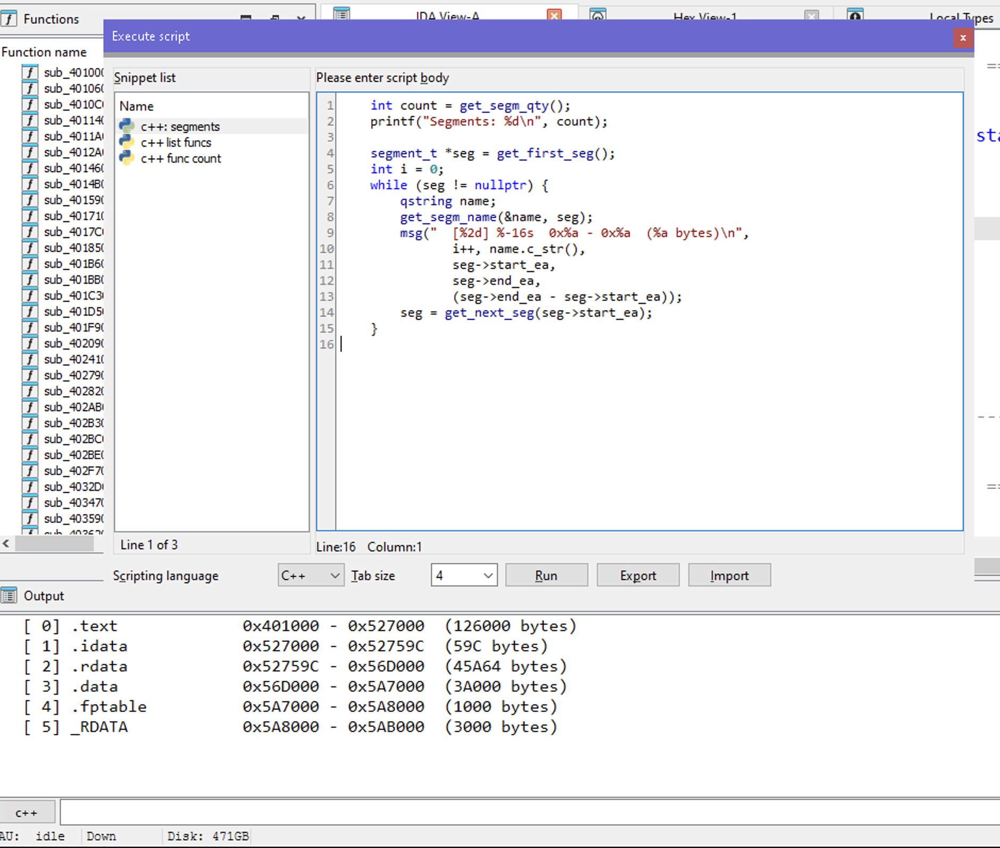
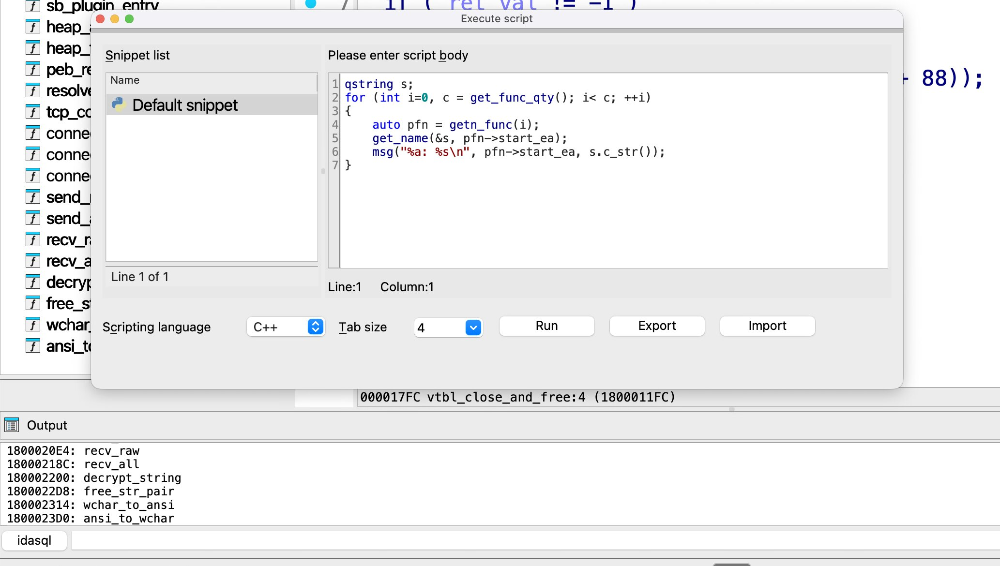
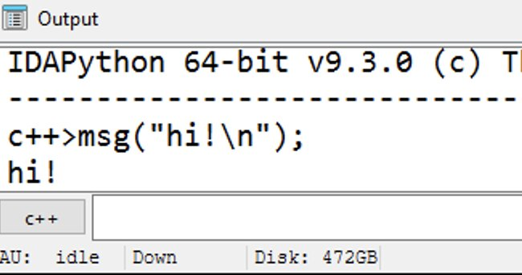

# idacpp

C++ scripting for IDA Pro — the C++ counterpart to [IDAPython](https://github.com/HexRaysSA/ida-sdk/tree/main/src/plugins/idapython).

idacpp embeds a C++ interpreter directly into IDA's scripting engine, giving you native access to the full IDA SDK — including Hex-Rays — at interpreter speed. No bindings, no FFI, no type translation: the same `ea_t`, `func_t*`, and `cfunc_t*` you use in compiled plugins, live in a REPL. Built on [Cling](https://github.com/root-project/cling) and Clang 20.

## Screenshots

<p align="center">

</p>
<p align="center"><em>Windows — C++ snippet listing segments</em></p>

<p align="center">

</p>
<p align="center"><em>macOS — C++ snippet listing functions</em></p>

<p align="center">

</p>
<p align="center"><em>C++ REPL tab in IDA's output window</em></p>

## Interactive REPL

Select the **C++** tab in IDA's output window:

```
C++> auto n = get_func_qty();
C++> msg("%d functions\n", n);
142 functions
C++> auto f = get_next_func(0);
C++> qstring name;
C++> get_func_name(&name, f->start_ea);
C++> msg("%s @ %a\n", name.c_str(), f->start_ea);
_start @ 0x1000
```

All declarations persist across lines — variables, functions, and types remain available for subsequent input.

## Scripts

```cpp
#include <funcs.hpp>
#include <segment.hpp>

int main() {
    msg("%d functions, %d segments\n",
           get_func_qty(), get_segm_qty());
    return 0;
}
```

```
C++> .x hello.cpp
4 functions, 3 segments
```

## What you can do

- **Interactive REPL** — C++ tab in IDA's output window with a persistent session
- **Full IDA SDK** — headers available via PCH (or source-header fallback), including Hex-Rays decompiler types
- **Script execution** — `.x` scripts with `main()` entrypoint; reloading auto-unloads the previous version
- **Code completion** — SDK-aware completions with prefix matching
- **Crash recovery** — `SIGSEGV` / SEH caught, interpreter stays alive
- **Undo / rollback** — `.undo` and `.clear` to revert interpreter state
- **Expression evaluator** — IDA's expression engine routes through C++ when active
- **Plain C++ mode** — works without IDA SDK as a C++ REPL (no SDK types available)

## Examples

The [`examples/`](examples/) directory contains ready-to-run scripts:

| Script | Description |
|--------|-------------|
| [`hello.cpp`](examples/hello.cpp) | Minimal starter — prints function and segment counts |
| [`list_functions.cpp`](examples/list_functions.cpp) | Enumerate all functions with addresses and names |
| [`list_segments.cpp`](examples/list_segments.cpp) | Enumerate all segments with address ranges |
| [`decompile_first.cpp`](examples/decompile_first.cpp) | Decompile the first function using Hex-Rays |
| [`xrefs.cpp`](examples/xrefs.cpp) | List cross-references to the first function |

## Quick start

### Agent-assisted install

Feed [`install-agent.md`](install-agent.md) to your AI coding agent (Claude Code, Cursor, etc.) — it will clone the dependencies, build LLVM/Cling, and compile the plugin automatically.

### Manual

```bash
git clone https://github.com/allthingsida/idacpp.git
cd idacpp && mkdir build && cd build
cmake .. -DCLINGLITE_SOURCE_DIR=/path/to/clinglite \
         -DCLING_BUILD_DIR=/path/to/cling-build \
         -DIDASDK=/path/to/idasdk
cmake --build . --config Release
```

The build produces `idacpp.dll` / `idacpp.so` / `idacpp.dylib`, placed in the IDA SDK plugin directory by CMake. See [BUILDING.md](BUILDING.md) for prerequisites, platform-specific instructions, and build output details.

## Plugins

idacpp has a plugin system that extends the REPL with additional headers, libraries, and PCH contributions. Plugins are auto-discovered from `plugins/*/CMakeLists.txt` and enabled via cmake variables.

### Available plugins

| Plugin | Variable | Auto-enabled | Description |
|--------|----------|--------------|-------------|
| `ida_sdk` | *(always on)* | Yes | IDA SDK headers and idalib — the base layer |
| [`idax`](plugins/idax/) | `-DPLUGIN_IDAX_SRC_DIR=<path>` | When source dir is provided | [idax](https://github.com/19h/idax) C++23 SDK wrapper by [Kenan Sulayman](https://github.com/19h) |
| `winsdk` | `-DPLUGIN_WINSDK=ON` | `WIN32` | Windows SDK headers (windows.h, tlhelp32.h, etc.) |
| `linux` | `-DPLUGIN_LINUX=ON` | `UNIX AND NOT APPLE` | Linux system headers (sys/mman.h, elf.h, etc.) |

### Enable / disable

```bash
# Enable by providing source directory
cmake .. -DPLUGIN_IDAX_SRC_DIR=/path/to/idax

# Disable an auto-enabled plugin
cmake .. -DPLUGIN_WINSDK=OFF
```

In the monorepo, plugins are auto-enabled based on platform and source availability — no flags needed.

### idax examples

The idax plugin includes [example scripts](plugins/idax/examples/) using the C++23 API:

| Script | Description |
|--------|-------------|
| [`list_functions.cpp`](plugins/idax/examples/list_functions.cpp) | All functions with addresses and names |
| [`list_segments.cpp`](plugins/idax/examples/list_segments.cpp) | Segments with ranges and R/W/X permissions |
| [`database_info.cpp`](plugins/idax/examples/database_info.cpp) | File path, format, processor, bitness, MD5 |
| [`xrefs_to.cpp`](plugins/idax/examples/xrefs_to.cpp) | Cross-references to the first function |
| [`callers_callees.cpp`](plugins/idax/examples/callers_callees.cpp) | Call graph of the first function |
| [`find_calls.cpp`](plugins/idax/examples/find_calls.cpp) | Call instructions with resolved targets |
| [`imports.cpp`](plugins/idax/examples/imports.cpp) | Import modules and symbols |
| [`decompile.cpp`](plugins/idax/examples/decompile.cpp) | Decompile the first function (Hex-Rays) |

### Creating a new plugin

Copy `plugins/template/` and follow the [plugin README](plugins/README.md) for a detailed walkthrough.

## Documentation

| Document | Contents |
|----------|----------|
| [install-agent.md](install-agent.md) | Agent prompt for automated build & install |
| [BUILDING.md](BUILDING.md) | Prerequisites, CMake variables, platform builds, output sizes |
| [USAGE.md](USAGE.md) | CLI commands, script format, runtime setup, expression evaluator |
| [examples/](examples/) | Ready-to-run IDA SDK scripts |
| [plugins/](plugins/) | Plugin system — extending the REPL with additional APIs |

## Troubleshooting

- **`failed to initialize C++ interpreter`**: check `CLING_DIR` — it must point to a valid Cling/LLVM build tree with `lib/clang/<ver>/include/` intact.
- **`IDA SDK headers unavailable`**: set `IDASDK` to enable IDA API declarations in the interpreter.
- **Runtime library lookup issues**: set `IDADIR` to the IDA installation directory on the target machine.
- **Plugin load crash / abort on startup**: if test binaries that also link LLVM statically live in `$IDADIR/plugins/`, `init_library()` loads duplicate LLVM symbols and aborts. Move the plugin aside before running tests.

## License

MIT License. Copyright (c) Elias Bachaalany. See [LICENSE](LICENSE).

This project depends on [clinglite](https://github.com/0xeb/clinglite) and Cling — see their respective licenses.
